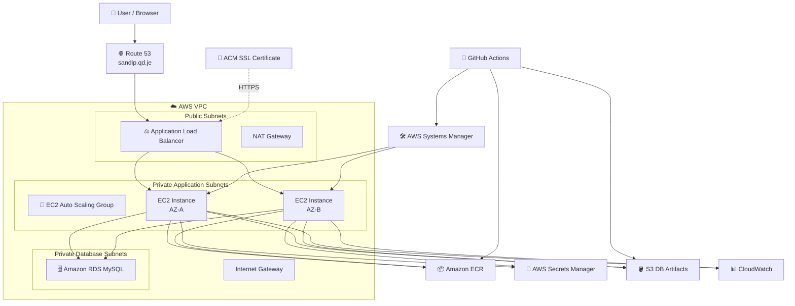
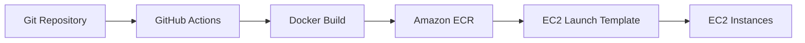
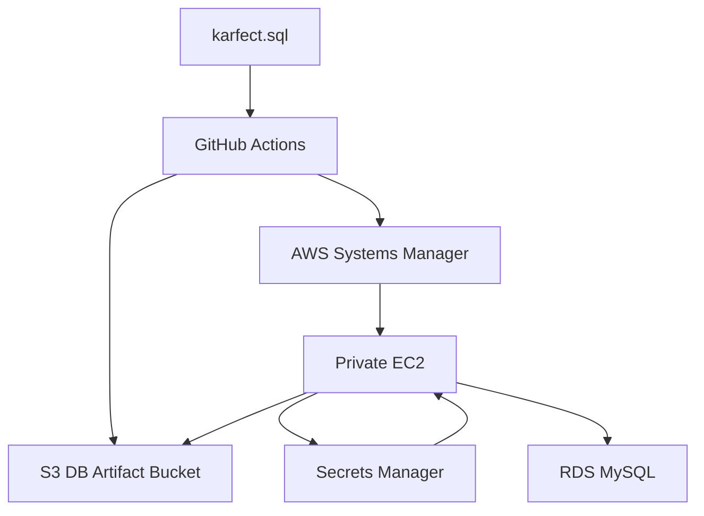
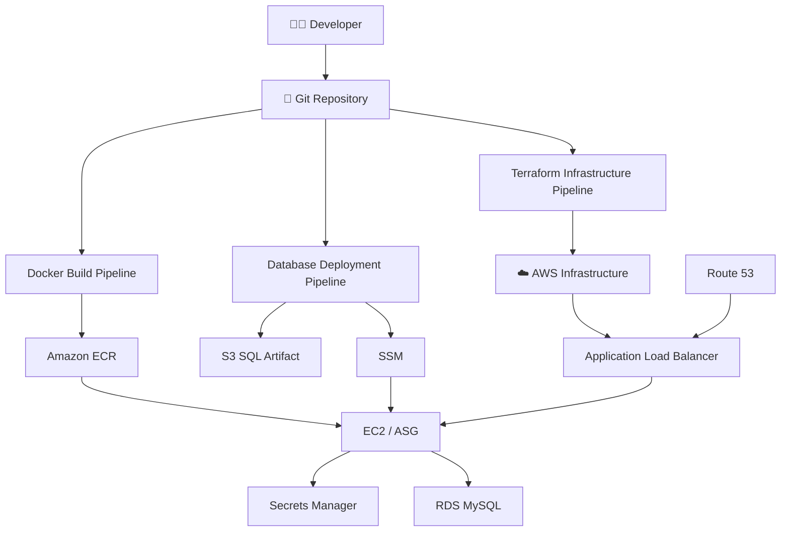

# 🚀 Karfect — Zero-Downtime Multi-AZ AWS Infrastructure

> A production-style AWS infrastructure project for deploying the **Karfect PHP application** with Terraform, Docker, Amazon ECR, EC2 Auto Scaling, Application Load Balancer, Amazon RDS MySQL, AWS Secrets Manager, S3, CloudWatch, SSM, ACM, Route 53, and GitHub Actions CI/CD.

---

## 📌 Table of Contents

- [Project Overview](#-project-overview)
- [Architecture](#-architecture)
- [Architecture Diagram](#-architecture-diagram)
- [Request Flow](#-request-flow)
- [Infrastructure Components](#-infrastructure-components)
- [Application Stack](#-application-stack)
- [Terraform Structure](#-terraform-structure)
- [CI/CD Pipelines](#-cicd-pipelines)
- [Docker Image Flow](#-docker-image-flow)
- [Database Architecture](#-database-architecture)
- [Database Initialization Pipeline](#-database-initialization-pipeline)
- [Secrets Management](#-secrets-management)
- [Networking](#-networking)
- [Load Balancing and High Availability](#-load-balancing-and-high-availability)
- [Auto Scaling](#-auto-scaling)
- [Monitoring](#-monitoring)
- [SSL/TLS and DNS](#-ssltls-and-dns)
- [IAM and Security](#-iam-and-security)
- [Terraform Remote State](#-terraform-remote-state)
- [Deployment Workflow](#-deployment-workflow)
- [How to Build This Project](#-how-to-build-this-project)
- [Prerequisites](#-prerequisites)
- [Configuration](#-configuration)
- [Verification](#-verification)
- [Troubleshooting](#-troubleshooting)
- [Important Design Decisions](#-important-design-decisions)
- [Skills Demonstrated](#-skills-demonstrated)
- [Future Improvements](#-future-improvements)

---

# 📖 Project Overview

**Karfect** is deployed as a highly available AWS application using a multi-AZ architecture.

The project demonstrates how to move from a simple application deployment to a more production-oriented cloud architecture with:

- Infrastructure as Code
- Modular Terraform
- Remote Terraform state
- Dockerized application
- Private database
- Application Load Balancer
- Auto Scaling Group
- Multi-AZ networking
- Managed secrets
- IAM roles
- Centralized monitoring
- SSM-based server access
- Automated database initialization
- GitHub Actions CI/CD
- HTTPS with ACM
- Route 53 DNS

The application itself is a PHP/MySQL-based service-provider application called **Karfect**.

---

# 🏗️ Architecture

The architecture separates public-facing infrastructure from private application and database resources.

### High-level architecture



---

# 🔄 Request Flow

When a user opens:

```text
https://sandip.qd.je
```

the request follows this path:

```text
Browser
   │
   ▼
Route 53
   │
   ▼
Application Load Balancer
   │
   ├───────────────┐
   ▼               ▼
EC2 / AZ-A      EC2 / AZ-B
   │               │
   └───────┬───────┘
           ▼
      RDS MySQL
```

The ALB performs health checks against the application instances.

If one instance becomes unhealthy:

```text
ALB
 │
 ├── ❌ EC2-A unhealthy
 │
 └── ✅ EC2-B healthy
          ↓
    Traffic continues
```

This provides application-level high availability.

---

# 🧩 Infrastructure Components

| Component | Purpose |
|---|---|
| Amazon VPC | Isolated AWS network |
| Public Subnets | ALB and internet-facing networking |
| Private Subnets | Application EC2 instances |
| DB Subnets | Private RDS placement |
| Internet Gateway | Internet connectivity for public resources |
| NAT Gateway | Outbound internet access from private resources |
| EC2 | Runs the Dockerized Karfect application |
| Auto Scaling Group | Maintains desired application capacity |
| Application Load Balancer | Distributes HTTP/HTTPS traffic |
| Target Group | Performs EC2 health checks |
| Amazon RDS MySQL | Managed relational database |
| Amazon ECR | Stores Docker images |
| S3 | Stores temporary database artifacts |
| Secrets Manager | Stores database credentials |
| Systems Manager | Secure EC2 access and remote commands |
| CloudWatch | Monitoring, metrics, alarms and dashboard |
| SNS | Sends CloudWatch alarm notifications |
| ACM | Provides TLS certificate |
| Route 53 | DNS |
| IAM | Least-privilege AWS permissions |
| Terraform | Infrastructure as Code |
| GitHub Actions | CI/CD automation |

---

# 💻 Application Stack

The application is containerized using Docker.

### Application

```text
PHP
Apache
PDO / MySQL
MySQL database
```

### Docker

The application image is based on:

```dockerfile
php:8.2-apache
```

PHP extensions include:

```text
pdo
pdo_mysql
mysqli
```

Composer is used to install PHP dependencies, including:

```text
aws/aws-sdk-php
```

The AWS SDK is required by the application to retrieve database credentials from Secrets Manager using the EC2 IAM role.

---

# 📁 Terraform Structure

The infrastructure is organized into reusable Terraform modules.

Example structure:

```text
terraform/
│
├── bootstrap/
│   └── ...
│
├── environment/
│   ├── main.tf
│   ├── acm.tf
│   ├── variables.tf
│   ├── outputs.tf
│   └── ...
│
└── module/
    │
    ├── networking/
    ├── launch_template/
    ├── asg/
    ├── load-balancer/
    ├── tg-group/
    ├── db_security_group/
    ├── lb_security_group/
    ├── rds/
    ├── monitoring/
    └── compute/
```

### Why modules?

Instead of putting the complete infrastructure into one large Terraform file, the project separates responsibilities.

For example:

```text
networking
     ↓
VPC
Subnets
Route Tables
NAT
Internet Gateway

launch_template
     ↓
IAM Role
Launch Template

asg
     ↓
Auto Scaling Group

load-balancer
     ↓
ALB

rds
     ↓
RDS
Subnet Group
```

This makes the infrastructure easier to maintain and reuse.

---

# 🔐 Terraform Remote State

Terraform state is stored remotely in Amazon S3.

Conceptually:

```text
Developer / GitHub Actions
          │
          ▼
    terraform init
          │
          ▼
      S3 Backend
          │
          ▼
 terraform.tfstate
```

Remote state allows multiple environments and CI/CD runners to work with the same infrastructure state instead of keeping state only on one local machine.

---

# 🐳 Docker Image Flow

The application image is built and pushed to Amazon ECR.



The image is tagged using the Git commit SHA.

Example:

```text
929616024576.dkr.ecr.us-east-1.amazonaws.com/
multi-az-zero-downtime-ecr:<GIT_SHA>
```

Using the commit SHA gives each deployment an identifiable immutable image version.

---

# 🔄 CI/CD Pipelines

The project uses separate GitHub Actions workflows.

## 1. Infrastructure Pipeline

The infrastructure pipeline performs:

```text
Checkout
   ↓
AWS Authentication
   ↓
Terraform Init
   ↓
Terraform Format Check
   ↓
Terraform Validate
   ↓
Terraform Plan
   ↓
Upload Plan Artifact
   ↓
Terraform Apply
```

### Terraform Validate

Checks whether the Terraform configuration is syntactically and structurally valid.

### Terraform Plan

Creates a saved plan:

```bash
terraform plan -out=tfplan
```

The plan is uploaded as a GitHub Actions artifact.

### Terraform Apply

The same saved plan is downloaded and applied:

```bash
terraform apply -auto-approve tfplan
```

This ensures the apply uses the planned changes.

---

# 📦 Docker Build & Push Pipeline

The Docker pipeline:

```text
Checkout
   ↓
Configure AWS
   ↓
Login to ECR
   ↓
Create application environment file
   ↓
Docker Build
   ↓
Push image to ECR
```

Two image tags are pushed:

```text
latest
<github.sha>
```

The commit SHA is used by the infrastructure deployment to identify the exact application version.

---

# 🗄️ Database Architecture

The database is Amazon RDS MySQL.

The RDS instance is placed in private database subnets.

```text
Private EC2
     │
     │ TCP 3306
     ▼
RDS MySQL
```

The database is not exposed directly to the public internet.

### Security Group rule

RDS allows:

```text
Protocol: TCP
Port: 3306
Source: Application EC2 Security Group
```

The EC2 security group does not need inbound port 3306.

---

# 🗃️ Database Initialization Pipeline

Database initialization is automated through GitHub Actions.

The SQL file:

```text
app/karfect/Database/karfect.sql
```

is uploaded to the Terraform-created S3 artifact bucket.

Flow:



### Detailed process

1. Terraform state is initialized.
2. The S3 artifact bucket name is retrieved from Terraform output.
3. `karfect.sql` is uploaded to S3.
4. GitHub Actions identifies the running application EC2 instance.
5. SSM sends a shell script to the EC2 instance.
6. EC2 installs the MySQL client if required.
7. EC2 downloads the SQL file from S3.
8. EC2 reads the database secret from Secrets Manager.
9. The RDS connection is tested.
10. The `karfect` database is created if it does not exist.
11. The SQL file is imported.
12. Temporary files are removed.
13. The SQL artifact is removed from S3.

---

# 🔑 Secrets Management

Database credentials are stored in:

```text
AWS Secrets Manager
```

Example secret structure:

```json
{
  "database": "karfect",
  "host": "RDS-ENDPOINT",
  "password": "********",
  "port": 3306,
  "username": "admin"
}
```

The application does **not** need hardcoded AWS access keys.

Instead:

```text
Application Container
        ↓
AWS SDK for PHP
        ↓
EC2 IAM Role
        ↓
Secrets Manager
        ↓
DB credentials
```

The EC2 IAM role receives only the required Secrets Manager permissions.

Example permissions:

```text
secretsmanager:GetSecretValue
secretsmanager:DescribeSecret
```

---

# 🛡️ IAM and Security

IAM is used to avoid putting long-lived AWS credentials inside the application.

The EC2 role provides permissions required by the instance.

Typical responsibilities include:

```text
AmazonSSMManagedInstanceCore
        ↓
SSM access

ECR permissions
        ↓
Pull Docker image

CloudWatch permissions
        ↓
Monitoring

Secrets Manager policy
        ↓
Read database secret

S3 artifact policy
        ↓
Read database SQL artifact
```

### Principle of least privilege

Resources should only receive the permissions they actually need.

For example, the application EC2 does not need unrestricted Secrets Manager access. It only needs access to the database secret.

---

# 🛠️ AWS Systems Manager

SSM is used to access private EC2 instances without opening SSH to the internet.

Architecture:

```text
Developer
    │
    ▼
AWS Systems Manager
    │
    ▼
Private EC2
```

This is useful because the application instances are private.

SSM is also used by the database pipeline to execute commands remotely.

---

# 🌐 Networking

The VPC uses multiple Availability Zones.

Conceptually:

```text
                    VPC
                     │
          ┌──────────┴──────────┐
          │                     │
        AZ-A                  AZ-B
          │                     │
     Public Subnet         Public Subnet
          │                     │
         ALB                   ALB
          │                     │
     Private Subnet        Private Subnet
          │                     │
         EC2                   EC2
          │                     │
          └──────────┬──────────┘
                     │
              Private DB Subnets
                     │
                    RDS
```

### Public subnet

Used for internet-facing components such as:

- Application Load Balancer
- NAT Gateway

### Private application subnet

Used for:

- EC2 application instances

### Private database subnet

Used for:

- RDS

---

# ⚖️ Load Balancing and High Availability

The Application Load Balancer distributes traffic across healthy EC2 instances.

The target group performs health checks.

Example:

```text
ALB
 │
 ├── EC2-A → Healthy
 │
 └── EC2-B → Healthy
```

If EC2-A becomes unhealthy:

```text
ALB
 │
 ├── EC2-A → ❌ Unhealthy
 │
 └── EC2-B → ✅ Healthy
                    ↓
              Traffic continues
```

The unhealthy target is removed from normal traffic until it becomes healthy again.

---

# 📈 Auto Scaling

The application is deployed using an Auto Scaling Group.

Example configuration used during the project:

```text
Minimum: 1
Desired: 2
Maximum: 4
```

This allows the application layer to scale according to capacity requirements.

The Launch Template defines how new instances are created.

The instances automatically receive:

- Application Docker configuration
- IAM role
- ECR access
- SSM access
- Monitoring permissions

---

# 📊 Monitoring

CloudWatch is used for infrastructure monitoring.

The project includes CloudWatch alarms for resources such as:

### ALB

- 5xx errors
- Healthy hosts
- Response time
- Target 5xx errors

### ASG

- In-service instances
- Pending instances

### RDS

- CPU
- Database connections
- Memory-related metrics
- Storage

SNS is used for alert notifications.

Architecture:

```text
AWS Resources
      ↓
CloudWatch Metrics
      ↓
CloudWatch Alarms
      ↓
SNS
      ↓
Notification
```

A CloudWatch dashboard provides centralized visibility into the infrastructure.

---

# 🔐 SSL/TLS and DNS

The application uses:

```text
sandip.qd.je
```

### Route 53

Route 53 hosts the DNS record.

The domain points to the Application Load Balancer.

```text
sandip.qd.je
      ↓
Route 53
      ↓
ALB DNS
```

### ACM

AWS Certificate Manager provides the TLS certificate.

The certificate is validated using DNS validation records in Route 53.

```text
ACM Certificate
      ↓
DNS Validation
      ↓
Route 53
      ↓
Issued Certificate
      ↓
HTTPS Listener
```

The ALB HTTPS listener uses the ACM certificate.

---

# 🔒 Security Groups

Security groups provide network-level access control.

Typical traffic model:

```text
Internet
   │
   ▼
ALB : 80 / 443
   │
   ▼
EC2 : 80
   │
   ▼
RDS : 3306
```

### ALB Security Group

Allows public HTTP/HTTPS traffic.

### EC2 Security Group

Allows application traffic from the ALB security group.

### RDS Security Group

Allows MySQL 3306 only from the EC2 security group.

This avoids exposing the database publicly.

---

# 🪣 S3 Database Artifact Storage

A dedicated S3 bucket is used temporarily for database initialization artifacts.

Example:

```text
multi-az-zero-downtime-db-artifacts-2026
```

The SQL file is uploaded only when the database pipeline runs.

After successful database initialization, the SQL artifact is removed.

This keeps the database dump separate from the application image.

---

# 🔄 Complete Deployment Flow



---

# 🧪 How to Build This Project

## Step 1 — Create the Terraform backend

Create the foundational backend infrastructure for storing Terraform state.

Configure:

```text
S3 backend
```

and the required state-management resources.

---

## Step 2 — Build the VPC

Create:

- VPC
- Public subnets
- Private application subnets
- Private database subnets
- Internet Gateway
- NAT Gateway
- Route tables
- Route table associations
- Elastic IP

---

## Step 3 — Create Security Groups

Create separate security groups for:

```text
ALB
EC2
RDS
```

Keep the traffic relationships restricted.

---

## Step 4 — Create IAM Roles

Create an EC2 IAM role with required permissions for:

- SSM
- ECR
- CloudWatch
- Secrets Manager
- S3 database artifact access

---

## Step 5 — Create RDS

Create:

- DB subnet group
- RDS MySQL instance
- RDS security group

Keep the database private.

---

## Step 6 — Create Secrets Manager Secret

Create the database secret.

Store:

```text
host
username
password
database
port
```

The application retrieves these values dynamically.

---

## Step 7 — Build the Docker Image

The Dockerfile installs:

```text
PHP 8.2
Apache
PDO
PDO MySQL
MySQLi
Composer
AWS SDK for PHP
```

Build and push the image to ECR.

---

## Step 8 — Create Launch Template

The Launch Template defines:

- AMI
- Instance type
- IAM instance profile
- Security group
- Docker configuration
- ECR image
- Application startup

---

## Step 9 — Create Auto Scaling Group

Configure:

```text
Minimum instances
Desired instances
Maximum instances
```

Deploy instances across multiple Availability Zones.

---

## Step 10 — Create ALB

Create:

- ALB
- Target Group
- HTTP listener
- HTTPS listener
- ACM certificate

Configure health checks.

---

## Step 11 — Configure Route 53

Create the application DNS record:

```text
sandip.qd.je
```

pointing to the ALB.

---

## Step 12 — Configure CloudWatch

Create:

- Dashboard
- Metrics
- Alarms
- SNS notification

Monitor ALB, ASG and RDS.

---

## Step 13 — Initialize Database

Run the database deployment workflow.

It:

```text
SQL
 ↓
S3
 ↓
SSM
 ↓
EC2
 ↓
Secrets Manager
 ↓
RDS
```

---

## Step 14 — Verify Application

Open:

```text
https://sandip.qd.je
```

Verify:

- HTTPS works
- ALB is healthy
- EC2 targets are healthy
- Application loads
- Application connects to RDS
- Database tables are available

---

# ⚙️ Prerequisites

Before building the project, install/configure:

- AWS account
- AWS CLI
- Terraform
- Docker
- Git
- GitHub repository
- GitHub Actions
- IAM credentials/OIDC or appropriate GitHub Actions AWS authentication

AWS resources required include:

- VPC
- EC2
- ECR
- RDS
- S3
- Secrets Manager
- ALB
- Route 53
- ACM
- CloudWatch
- SSM
- IAM

---

# ⚙️ Configuration

The Terraform environment contains variables for environment-specific values such as:

```text
AWS region
project name
Docker image tag
network configuration
database configuration
```

The Docker image tag is passed from GitHub Actions using the Git commit SHA.

Example:

```bash
terraform plan \
  -var="docker_image_tag=${GITHUB_SHA}"
```

This allows infrastructure deployment to reference the exact Docker image produced by the CI pipeline.

---

# 🔍 Verification

## Check EC2 instances

```bash
aws ec2 describe-instances
```

## Check ALB target health

```bash
aws elbv2 describe-target-health \
  --target-group-arn <TARGET-GROUP-ARN>
```

Expected:

```text
State: healthy
```

## Check ECR images

```bash
aws ecr describe-images \
  --repository-name multi-az-zero-downtime-ecr
```

## Check RDS

```bash
aws rds describe-db-instances
```

## Check Secrets Manager

```bash
aws secretsmanager describe-secret \
  --secret-id db_secret_manager
```

## Check SSM

```bash
aws ssm describe-instance-information
```

## Check Terraform state

```bash
terraform state list
```

---

# 🐛 Troubleshooting

## ALB target is unhealthy

Check:

```bash
aws elbv2 describe-target-health \
  --target-group-arn <TARGET-GROUP-ARN>
```

Then connect to the EC2 instance through SSM and check:

```bash
docker ps -a
```

Also verify the application is listening on port 80.

---

## Docker image cannot be pulled

Verify:

1. ECR repository exists.
2. Image tag exists.
3. EC2 IAM role has ECR permissions.
4. The Launch Template references the correct repository URI and image tag.

Example:

```text
ACCOUNT_ID.dkr.ecr.us-east-1.amazonaws.com/
multi-az-zero-downtime-ecr:<GIT_SHA>
```

---

## Application shows database connection error

Check:

```bash
docker logs karfect-app
```

Verify:

- AWS SDK for PHP is installed
- EC2 IAM role has `secretsmanager:GetSecretValue`
- Secret exists
- RDS endpoint is correct
- RDS security group allows EC2 security group on port 3306
- Database name is correct

---

## SSM command fails to read the secret

Verify the EC2 IAM role has:

```text
secretsmanager:GetSecretValue
secretsmanager:DescribeSecret
```

for the specific database secret.

---

## Terraform saved plan is stale

A saved Terraform plan can become invalid if the Terraform state changes after the plan was created.

Create a new plan:

```bash
terraform plan -out=tfplan
```

and apply that newly generated plan.

---

## S3 bucket cannot be destroyed

If the artifact bucket contains objects or object versions, AWS can reject bucket deletion.

For a disposable development bucket, Terraform can use:

```hcl
force_destroy = true
```

For production data, do not use this casually because it can remove stored objects.

---

# 🧠 Important Design Decisions

## Why ALB?

The ALB provides:

- Traffic distribution
- Health checks
- HTTPS termination
- High availability

---

## Why Auto Scaling?

It allows the application layer to automatically maintain the desired number of instances and replace unhealthy instances.

---

## Why RDS?

RDS provides a managed MySQL database without requiring manual database-server administration.

---

## Why Secrets Manager?

Database passwords should not be embedded directly into application source code.

Secrets Manager provides centralized secret storage and controlled access.

---

## Why IAM Role instead of AWS access keys?

The application can use temporary credentials supplied through the EC2 role rather than storing permanent AWS keys inside the container.

---

## Why SSM instead of SSH?

The EC2 instances are private. SSM allows administrative access and remote command execution without opening SSH to the public internet.

---

## Why S3 for database artifacts?

The SQL dump is kept separate from the application container image and can be transferred securely to the private EC2 instance during database initialization.

---

## Why Terraform modules?

Modules separate infrastructure responsibilities and make the configuration easier to maintain.

---

## Why Git commit SHA for Docker tags?

A Git SHA provides a traceable version of the application image.

Instead of:

```text
latest
```

you can identify exactly which commit produced the deployed image.

---

# 🏆 Skills Demonstrated

This project demonstrates practical experience with:

### AWS

- VPC
- EC2
- ECR
- RDS
- S3
- Secrets Manager
- IAM
- ALB
- Target Groups
- Auto Scaling
- Route 53
- ACM
- CloudWatch
- SNS
- Systems Manager

### Infrastructure as Code

- Terraform
- Terraform modules
- Terraform remote state
- Terraform variables
- Terraform outputs
- Terraform plans
- Terraform state management

### Containers

- Docker
- Dockerfile
- PHP/Apache container
- ECR
- Image versioning

### CI/CD

- GitHub Actions
- Terraform validation
- Terraform planning
- Terraform apply
- Docker build
- ECR push
- Database deployment automation
- SSM automation

### Linux / System Administration

- Linux
- Package management
- Docker administration
- Networking
- SSM
- Process/service troubleshooting
- Application logs

### Security

- IAM roles
- Least privilege
- Security groups
- Private subnets
- Secrets Manager
- HTTPS/TLS
- No public database access

---

# 📈 Future Improvements

Possible production-level extensions include:

- OIDC authentication between GitHub Actions and AWS instead of long-lived AWS access keys
- Separate development, staging and production environments
- Automated database backup/restore strategy
- RDS Multi-AZ deployment
- RDS encryption with customer-managed KMS keys
- Secrets Manager automatic rotation
- CloudWatch Logs centralization
- WAF in front of the ALB
- CloudFront for static assets
- Blue/green deployments
- Rolling deployments with stronger deployment health checks
- Automated integration tests before production deployment
- Manual approval before production Terraform apply
- Terraform policy/security scanning
- Container vulnerability scanning
- Automated rollback

---

# 🎯 Final Architecture Summary

```text
                         INTERNET
                            │
                            ▼
                     ┌──────────────┐
                     │   Route 53   │
                     │ sandip.qd.je │
                     └──────┬───────┘
                            │
                            ▼
                 ┌────────────────────┐
                 │ Application Load   │
                 │     Balancer       │
                 │    HTTPS / ACM     │
                 └─────────┬──────────┘
                           │
             ┌─────────────┴─────────────┐
             │                           │
             ▼                           ▼
      ┌─────────────┐             ┌─────────────┐
      │ EC2 / AZ-A  │             │ EC2 / AZ-B  │
      │ Docker App  │             │ Docker App  │
      └──────┬──────┘             └──────┬──────┘
             │                           │
             └─────────────┬─────────────┘
                           │
                    TCP 3306 only
                           │
                           ▼
                  ┌─────────────────┐
                  │   RDS MySQL     │
                  │ Private Subnet  │
                  └─────────────────┘

          Supporting Services
          ───────────────────

     ┌─────────────┐       ┌───────────────┐
     │    ECR      │──────▶│  EC2 Docker   │
     └─────────────┘       └───────────────┘

     ┌─────────────┐       ┌───────────────┐
     │  Secrets    │──────▶│  EC2 IAM Role │
     │   Manager   │       └───────────────┘
     └─────────────┘

     ┌─────────────┐       ┌───────────────┐
     │     S3      │──────▶│  DB Artifact  │
     │ SQL Storage │       │   Transfer    │
     └─────────────┘       └───────────────┘

     ┌─────────────┐
     │     SSM     │──────▶ Private EC2
     └─────────────┘

     ┌─────────────┐
     │ CloudWatch  │──────▶ Metrics / Alarms
     └─────────────┘

     ┌──────────────────────────────────────────┐
     │              GitHub Actions              │
     │                                          │
     │ Terraform → AWS Infrastructure           │
     │ Docker → ECR                              │
     │ SSM → Database Initialization             │
     └──────────────────────────────────────────┘
```

---

# 👨‍💻 Project Goal

The goal of this project is to demonstrate how a containerized PHP application can be deployed on AWS using Infrastructure as Code and automated CI/CD while maintaining:

**High Availability + Security + Automation + Observability + Reproducibility**

---

## ⭐ Project Highlights

- ✅ Multi-AZ application architecture
- ✅ Infrastructure as Code with Terraform
- ✅ Modular Terraform design
- ✅ Dockerized PHP application
- ✅ Amazon ECR image registry
- ✅ EC2 Auto Scaling
- ✅ Application Load Balancer
- ✅ Private RDS MySQL
- ✅ AWS Secrets Manager
- ✅ IAM role-based authentication
- ✅ SSM private server management
- ✅ S3 database artifact workflow
- ✅ Automated database initialization
- ✅ Route 53 DNS
- ✅ ACM HTTPS
- ✅ CloudWatch monitoring
- ✅ SNS alerts
- ✅ GitHub Actions CI/CD
- ✅ Immutable Git SHA Docker image tagging

---

**Built with AWS + Terraform + Docker + GitHub Actions ❤️**
